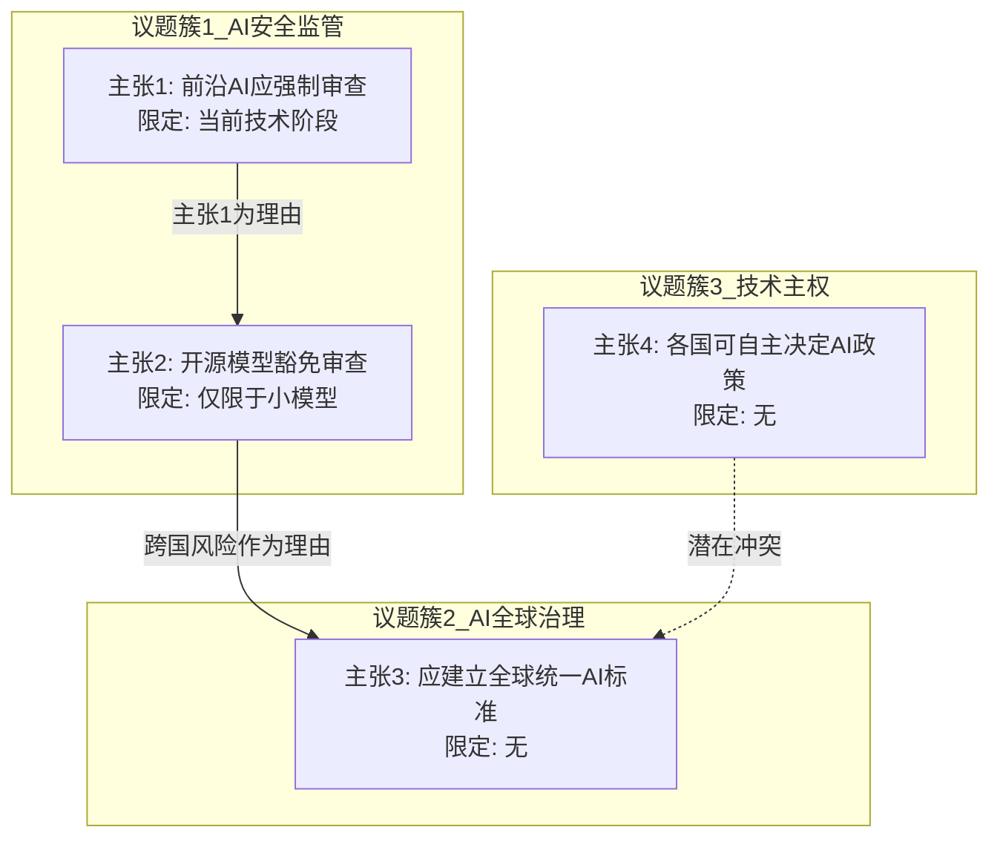

# 前置输入要求

启动本skill前，必须确保以下条件满足。若不满足，应暂停分析并请求用户提供缺失信息。

1. **言论语料**：需提供被分析对象在足够长的时间跨度内的全部可获取言论，包括但不限于公开发言、采访记录、文章著作、社交媒体内容、会议记录等。
2. **语境信息（推荐）** ：每条言论的时间、场合、受众。若无法提供，需声明分析的局限性。斯金纳为代表的剑桥学派强调，理解言论必须借助历史语境，脱离语境的分析容易陷入"连贯性神话"——即强加给文本本不存在的系统性。
3. **分析范围声明**：用户需明确是分析所有主题上的言论，还是特定主题范围。
4. **事实知识信息**：需主动搜索语料中提及的所有客观知识和论述，保证在分析前对于对象所论述的问题有完整正确的认知。

# 分析流程（五步）

## 第一步：预处理——观点单元提取

**操作**：将全部言论拆解为可独立分析的"观点单元"。每个观点单元包含以下字段：

| 字段 | 定义 | 示例 |
|------|------|------|
| 议题（Topic） | 言论所回应的具体问题或话题 | "AI监管"、"教育公平" |
| 主张（Claim） | 明确表达的断言或结论 | "应当对LLM实施强制性安全审查" |
| 理由（Grounds） | 支持主张的显性证据或理由 | "因为LLM可能被用于生成虚假信息" |
| 限定条件（Qualifier） | 对主张适用范围或确定性的修饰 | "至少在目前技术阶段"、"大概率" |
| 来源语境 | 时间、场合、受众 | "2024年3月某会议演讲" |

**方法论依据**：批判性思维理论将论证拆解为"结论—前提—推理关系"三重结构，Toulmin模型进一步细化为claim、grounds、warrant、backing、qualifier、rebuttal六要素。观点单元提取即按此框架完成对每条言论的第一层结构化。

**操作要点**：
- 对每条言论标注：`议题 | 主张 | 理由 | 限定条件 | 来源语境`
- 若某字段缺失（如未给出理由），如实标注为"未提供"，不得推测填补
- 对频率极低的议题（如仅提及一两次），同样纳入标注但标记为"低频"，不因其稀少而忽略

## 第二步：结构映射——思维体系的可视化

**操作**：将第一步产生的全部观点单元映射为一张"信念网络图"。

**核心逻辑**：个体的信念并非孤立存在，而是以网络形式相互依赖——对某个议题的立场往往取决于对其他议题的立场。这一步的目标是将散落的观点单元连接成一个可理解的关系结构。

**具体操作**：

1. **议题聚类**：将相同/相近议题的观点单元归为一组，形成"议题簇"
2. **主张排序与定位**：每个议题簇内，按主张的抽象程度或逻辑优先性排序，找出更基础和更衍生的主张
3. **跨议题连接**：识别不同议题簇之间的逻辑依赖关系——一个主张是否作为另一个主张的前提或理由出现
4. **整体映射**：将所有议题簇及其连接关系呈现为网络结构，可视化输出（推荐 Mermaid 格式，便于在 Markdown 环境中直接渲染）

**输出**：一张标注了节点（观点单元）和边（逻辑依赖关系）的信念网络图。

**画布选择**：全部构建工作应在同一画布上进行，以Mermaid格式呈现（Mindmap 适合层级清晰的体系，Graph 适合含交叉依赖的复杂网络）。

## 第三步：四维分析——核心问题的逐项回答

基于前两步的成果，逐一完成以下四个维度的分析。每个维度都对应一个核心问题。

### 维度一：议题覆盖与回避分析

**核心问题**：他思考了什么？回避了什么？

**分析项目**：

1. **议题覆盖热力图**
   - 对全部言论进行议题分类（可采用专题编码或主题聚类）
   - 统计各议题的言论频次，区分"频繁论述的议题"、"偶尔涉及的议题"、"从未提及的议题"
   - 将时间维度纳入考量：关注频率随时间的变化趋势，区分"阶段性关注"与"持续关注"

2. **回避的识别与判断**
   - 识别三种回避模式：
     - **结构性回避**：预期应涉及的议题（基于其声称的专业领域、角色身份或论述逻辑）但从未涉及
     - **转移性回避**：被问及某议题时转向其他议题，或仅以模糊用语带过
     - **选择性回避**：对同一议题的某些维度详述而另一些维度沉默
   - 判断标准：不得将"未提及"等同于"刻意回避"。只有当以下条件之一满足时，才可标记为"回避"：①言论语境中存在对该议题的直接提问而未回应；②该议题与其已论述内容存在强逻辑关联（不涉及将损害已论述内容的完整性）；③其身份/角色/宣称的专业领域使该议题成为合理预期

**输出**：
- 议题覆盖热力图（表格或图表）
- 回避议题清单（附判定依据）

### 维度二：结论内容分析

**核心问题**：在思考这些问题后，他得出了哪些结论？这些结论具有什么特征？

**分析项目**：

1. **结论提取**：从每个议题簇中提炼出明确的结论性主张。一个结论就是一个主张加上其所有限定条件（来自第一步），不得剥离限定条件来呈现结论

2. **结论的特征维度编码**：对每个结论标注以下特征：

   | 维度 | 选项 | 判定依据 |
   |------|------|----------|
   | 确定性 | 高 / 中 / 低 | 是否使用绝对化/概率化表述 |
   | 可证伪性 | 可 / 不可 | 是否存在可设想的反例或检验条件 |
   | 规范性/描述性 | 规范性（应然）/ 描述性（实然）| 是否包含"应当/必须"等规范性词汇 |
   | 抽象层级 | 具体 / 中等 / 抽象 | 距直接经验的距离 |

3. **结论间的逻辑一致性检查**
   - 将不同议题下的结论逐一配对比较
   - 检查是否存在逻辑矛盾（两个结论在语义上不能同时为真）或实践矛盾（两个结论蕴含的行动建议不可同时执行）
   - 若发现矛盾，需标注矛盾类型，评估是否可调和

**输出**：
- 结论清单及特征编码表
- 矛盾检测结果（如存在）

### 维度三：结论的普适性分析

**核心问题**：这些结论是特异性的还是普适性的？

**分析项目**：

1. **对每个结论进行"推理来源分析"**
   - 结论是从经验证据/个案观察中归纳而来？→ 判为**经验型**（多为特异性）
   - 结论是从先验原则/定义/逻辑推导而来？→ 判为**理性型**（倾向普适）
   - 结论是从他人的断言/权威/传统中获得？→ 判为**权威型**（普适性取决于所援引来源的普适性）

2. **适用条件检测**
   - 主动查找结论中是否明确或暗示了适用条件（如"在某制度下"、"对某类群体"、"在特定历史阶段"）
   - 有明确适用条件的→ 倾向于特异性
   - 无任何适用条件的→ 倾向于普适性

3. **综合判定**
   - 结合上述两项，为每个结论评定普适性等级：
     - **强普适**：理性型推导 + 无适用条件
     - **弱普适**：理性型推导但有隐含条件，或经验型但普遍化论证
     - **弱特异**：经验型推导 + 有适用条件
     - **强特异**：纯案例型 + 明确限定条件 + 缺少普遍化论证

**输出**：每个结论的普适性评级及判定理由

### 维度四：主体可互换性分析

**核心问题**：交换结论中的同层级主体还能成立吗？

*定义*：设结论形式为"A对B具有关系R"，将A替换为与A处于同一抽象层级（同一范畴、同一类别、同一角色层级）的另一个主体A'，检查"A'对B具有关系R"在逻辑上和事实上是否仍成立。

**操作步骤**：

1. **识别结论中的主体**：对于每个结论，明确其主语/施动者（主体A）和宾语/受动者（主体B，若存在）

2. **确定同层级主体候选集**：找到与A处于同一范畴或抽象层级的可替代主体集合。判断标准包括：相同的社会角色类别（如"某国政府"→"其他国家政府"）、相同的概念层级（如"大语言模型"→"其他AI模型"）、相同的制度层级（如"某类政策"→"同类政策"）

3. **执行互换测试**：
   - 将A替换为候选集中的每个A'
   - 逐个检查替换后的命题是否仍然成立
   - 记录结果：
     - **可互换**（替换后命题普遍成立）
     - **部分可互换**（部分同层主体替换后成立、部分不成立）
     - **不可互换**（替换后命题普遍不成立）

4. **分析不可互换性揭示的问题**
   - 若结论在主体互换后不再成立，则说明其推理依赖于主体A的独特属性而非其所属范畴的共有属性
   - 追问："这个结论被表述为A所属范畴的通用规律，但实际仅适用于A的独特状况"是否成立？——若成立，则意味着范畴错位，即结论的实际适用范围被夸大或误表述

**输出**：
- 每个结论的主体互换性测试结果
- 不可互换结论的分析说明（指出依赖了哪些独特属性）

## 第四步：深层结构挖掘（可选，但推荐执行）

在前三步"他说了什么"的基础上，此步聚焦"他没明说但实际依赖了什么"。

**分析项目**：

1. **未表达前提（Enthymeme）挖掘**
   - 对于每个论证，寻找其依赖但未明说的前提。在论证分析中，那些缺失的、未陈述的前提或结论被称为省略三段论，填充这些隐含假设是理解论证完整结构的必要步骤。
   - 操作：对论证进行"逻辑还原"——要使该论证的逻辑有效，至少需要补全哪些前提？将这些隐性前提显式列出

2. **预设框架识别**
   - 从多个未表达前提中寻找反复出现的共同预设，如：关于人性本质的预设（"人本质上是理性/非理性的"）、关于社会运作的预设（"社会本质上是冲突/和谐的"）、关于认知可能性的预设（"人能否获得客观真理"）
   - 这些预设构成该思维体系的"底层公理"

3. **深层一致性与张力检测**
   - 检查底层预设之间是否自洽
   - 检查底层预设与表层结论之间是否存在张力（如：底层持有"人本质上是自利的"预设，但某个表层结论却依赖"人会为了集体利益牺牲自己"）

**输出**：
- 隐性前提清单
- 底层预设框架摘要
- 深层张力检测结果

> **重要约束**：此步是分析中推测性最强的部分。每一步推断都应标注为"推测"，并提供支撑该推测的文本证据。避免越过文本证据进行过度诠释。斯金纳对传统观念史研究的一个重要批评，就是将文本从语境中剥离并强加系统性，任何对底层预设的推断都必须以足够数量的、一致性的文本迹象为基础，而非孤立线索的放大。

## 第五步：综合结论——思维体系全景描述

基于前四步的全部发现，输出综合描述。

**必须包含的结构要素**：

1. **思维体系的总体特征描述**
   - 该体系是高度系统化还是松散的？
   - 其内部一致性程度如何？
   - 其抽象层级分布如何（偏向具体经验还是抽象原则）？
   - 其论证风格（理性推导为主、经验归纳为主还是权威援引为主）？

2. **核心承诺与边缘主张**
   - "核心承诺"（Central Commitment）：指那些贯穿多个议题、作为其他主张的逻辑前提、或者被频繁且一致地坚持的主张。它们构成了该思维体系的支柱
   - "边缘主张"（Peripheral Claim）：仅出现在特定议题、与核心承诺缺乏强逻辑关联、或频率极低的主张
   - 区分标准：连入网络边数越多、出现频次越高、跨议题复用程度越高的主张，越接近核心

3. **思维体系的边界与盲区**
   - 该体系的议题覆盖边界在哪里（哪些类型的议题被系统性地排除在外）
   - 哪些重要的反论点或替代性观点未被纳入考量

4. **体系稳定性评估**
   - 是否存在内部矛盾及其严重程度
   - 系统在面对新信息或反常案例时容纳入现有框架的程度
   - 该体系主要的风险点：在什么情况下可能面临内部崩溃或被迫调整

5. **置信度声明**
   - 本分析建立在多少言论语料之上
   - 语料的完整性如何（是否可能存在未被收录的重要言论）
   - 分析的推测性部分（尤其是第四步）的置信度评估

# 输出格式模板

分析完成后，按以下层级组织输出：

```markdown
# 一、语料概述
- 言论语料的数量、时间跨度、来源类型摘要

# 二、信念网络图
- [Mermaid格式网络图]

# 三、四维分析

## 1. 议题覆盖与回避
- 热力图
- 回避清单

## 2. 结论提取与特征分析
- 结论清单及编码
- 一致性检测

## 3. 普适性分析
- 各结论普适性评级及理由

## 4. 主体互换性分析
- 各结论互换测试结果
- 不可互换项说明

# 四、深层结构（如执行）
- 隐性前提
- 底层预设
- 深层张力

# 五、综合结论
- 体系特征
- 核心承诺与边缘主张
- 边界与盲区
- 稳定性评估
- 置信度声明
```

# 关键原则与边界

## 必须遵守的原则

1. **证据锚定原则**：每一项分析结论必须能够回溯到具体的言论文本。引用原文或标注来源位置
2. **可证伪性原则**：分析框架自身必须是可被检验的——分析结论应当以这样一种方式陈述：如果提供相反的言论证据，分析结论可以被修正
3. **避免连贯性强加**：不得为了追求体系的完整性而忽略不一致或矛盾。一个真实的人的思维体系几乎不可能完全自洽，矛盾和张力本身就是重要的分析发现。这正是斯金纳所批评的"连贯性神话"——研究者不应为了方便叙事而将文本中不存在的系统性强加于人
4. **语境保留原则**：任何主张的陈述都不得剥离其原始语境中的限定条件。一个被剥离限定条件的结论已经被实质性篡改
5. **不推测动机原则**：分析"他回避了X"而非"他为了Y目的而回避X"。分析"他的结论之间存在矛盾"而非"他因Z心理而持有矛盾"。严格区分行为层面的描述与心理层面的解释

## 适用范围

- **适用**：拥有大量公开言论的个体（公共知识分子、政治人物、商业领袖、学者等）
- **部分适用**：言论数量较少的个体（可执行第一步和部分第二步，不应执行第四步或给出强结论）
- **不适用**：仅有零散二手转述而无一手言论文本的个体；虚构作品中人物的言论（需要不同的分析框架）

# 完整执行示例

以下以一个简化的虚构案例演示完整分析流程。

**被分析对象**：某学者关于AI治理的全部公开言论（假设已收集完整）

## 第一步预处理结果（部分节选）

| 序号 | 议题 | 主张 | 理由 | 限定条件 | 来源语境 |
|------|------|------|------|----------|----------|
| 1 | AI安全监管 | 应当对前沿AI模型实施强制性安全审查 | 因为前沿模型可能被用于生成大规模虚假信息 | 至少在目前技术阶段 | 2024年3月某会议演讲 |
| 2 | AI安全监管 | 开源模型不应被纳入强制审查 | 因为开源促进了技术民主化，审查会扼杀创新 | 小型开源模型 | 2025年1月某播客采访 |
| 3 | AI全球治理 | 需要建立全球统一的AI安全标准 | 因为AI风险是跨国界的，单国监管存在漏洞 | 无明确限定 | 2024年6月某论坛发言 |
| 4 | 技术主权 | 各国有权自主决定本国的AI监管政策 | 因为各国发展阶段和文化价值观不同 | 无明确限定 | 2024年6月同论坛问答环节 |

## 第二步信念网络图（局部）



## 第三步四维分析（部分）

**维度一：议题覆盖与回避**

| 覆盖议题 | 频次 | 趋势 |
|----------|------|------|
| AI安全监管 | 高频 | 持续 |
| AI全球治理 | 中频 | 上升 |
| 技术主权 | 低频 | 偶发 |

回避判断：该学者作为AI治理领域的公开声音，从未在任何场合讨论AI发展的能源环境影响，而该议题与其他已论述的AI治理议题存在强逻辑关联（AI监管政策不可避免涉及算力与能源分配）。判定为结构性回避。

**维度二与维度三合并：结论特征与普适性（代表性示例）**

| 结论 | 确定性 | 可证伪性 | 规范/描述 | 推理来源 | 普适性评级 | 理由 |
|------|--------|----------|-----------|----------|------------|------|
| 主张1（强制审查） | 高 | 可 | 规范性 | 经验+理性混合 | 弱普适 | 有"当前阶段"限定条件，属经验型但有普遍化论证 |
| 主张4（各国自主） | 高 | 可 | 规范性 | 原则推导 | 强普适 | 基于原则推导，无适用条件限定 |

**结论间矛盾检测**：主张3（全球统一标准）与主张4（各国自主决策）存在实践矛盾——若各国自主制定标准，技术上无法同时存在全球统一标准。这两个结论在同一次论坛中提出（2024年6月），不存在时间演化因素。

**维度四：主体互换性（选取关键结论）**

待测结论：`主张3: 需要建立全球统一的AI安全标准 → 该主张的隐含主语是"国际社会"或"各主权国家"`

| 将隐含主语替换为 | 命题 | 是否成立？ | 备注 |
|------------------|------|------------|------|
| （原命题）各主权国家 | 各主权国家需要建立全球统一AI标准 | 与主张4冲突 | 内部自相矛盾 |
| 某科技公司联盟 | 科技公司联盟需要建立全球统一AI标准 | 部分成立 | 缺乏执行权威 |
| 国际标准化组织 | 国际标准化组织需要建立全球统一AI标准 | 成立 | 这是ISO/RFC类机构的分内工作 |

分析：主张3在"主权国家"作为主体时与自身的主张4矛盾；在"公司联盟"作为主体时缺乏执行权威。仅在国际标准组织的同层主体上成立。这揭示主张3的有效性高度依赖特定主体属性（中立的、有共识形成机制的技术标准机构），而非"AI全球治理"这一全范畴的通用规律。

## 第五步综合结论（部分）

**总体特征**：该学者的AI治理思维体系呈现中等系统化程度。在AI安全监管议题上具有较完整的论证链（主张1→主张2），但在全球治理维度存在结构性矛盾（主张3↔主张4）。论证风格以规范性主张为主，偏向从原则推导出应然结论。体系内部有一个显著矛盾（全球统一标准与各国自主权之间的冲突），该矛盾尚未被其自身的言论所识别或调和。

