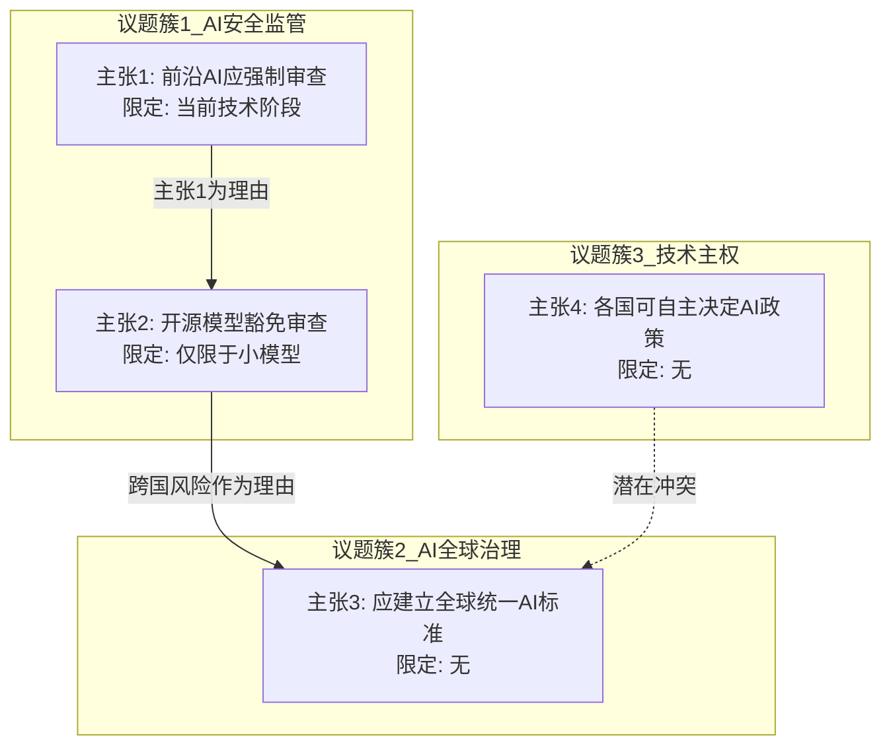

# 完整执行示例

**被分析对象**：某学者关于AI治理的全部公开言论（假设已收集完整）

## 第一步预处理结果（部分节选）

| 序号 | 议题 | 主张 | 理由 | 限定条件 | 来源语境 |
|------|------|------|------|----------|----------|
| 1 | AI安全监管 | 应当对前沿AI模型实施强制性安全审查 | 因为前沿模型可能被用于生成大规模虚假信息 | 至少在目前技术阶段 | 2024年3月某会议演讲 |
| 2 | AI安全监管 | 开源模型不应被纳入强制审查 | 因为开源促进了技术民主化，审查会扼杀创新 | 小型开源模型 | 2025年1月某播客采访 |
| 3 | AI全球治理 | 需要建立全球统一的AI安全标准 | 因为AI风险是跨国界的，单国监管存在漏洞 | 无明确限定 | 2024年6月某论坛发言 |
| 4 | 技术主权 | 各国有权自主决定本国的AI监管政策 | 因为各国发展阶段和文化价值观不同 | 无明确限定 | 2024年6月同论坛问答环节 |

## 第二步信念网络图（局部）

## 第三步四维分析（部分）

**维度一：议题覆盖与回避**

| 覆盖议题 | 频次 | 趋势 |
|----------|------|------|
| AI安全监管 | 高频 | 持续 |
| AI全球治理 | 中频 | 上升 |
| 技术主权 | 低频 | 偶发 |

回避判断：该学者作为AI治理领域的公开声音，从未在任何场合讨论AI发展的能源环境影响，而该议题与其他已论述的AI治理议题存在强逻辑关联（AI监管政策不可避免涉及算力与能源分配）。判定为结构性回避。

**维度二与维度三合并：结论特征与普适性（代表性示例）**

| 结论 | 确定性 | 可证伪性 | 规范/描述 | 推理来源 | 普适性评级 | 理由 |
|------|--------|----------|-----------|----------|------------|------|
| 主张1（强制审查） | 高 | 可 | 规范性 | 经验+理性混合 | 弱普适 | 有"当前阶段"限定条件，属经验型但有普遍化论证 |
| 主张4（各国自主） | 高 | 可 | 规范性 | 原则推导 | 强普适 | 基于原则推导，无适用条件限定 |

**结论间矛盾检测**：主张3（全球统一标准）与主张4（各国自主决策）存在实践矛盾——若各国自主制定标准，技术上无法同时存在全球统一标准。这两个结论在同一次论坛中提出（2024年6月），不存在时间演化因素。

**维度四：主体互换性（选取关键结论）**

待测结论：`主张3: 需要建立全球统一的AI安全标准 → 该主张的隐含主语是"国际社会"或"各主权国家"`

| 将隐含主语替换为 | 命题 | 是否成立？ | 备注 |
|------------------|------|------------|------|
| （原命题）各主权国家 | 各主权国家需要建立全球统一AI标准 | 与主张4冲突 | 内部自相矛盾 |
| 某科技公司联盟 | 科技公司联盟需要建立全球统一AI标准 | 部分成立 | 缺乏执行权威 |
| 国际标准化组织 | 国际标准化组织需要建立全球统一AI标准 | 成立 | 这是ISO/RFC类机构的分内工作 |

分析：主张3在"主权国家"作为主体时与自身的主张4矛盾；在"公司联盟"作为主体时缺乏执行权威。仅在国际标准组织的同层主体上成立。这揭示主张3的有效性高度依赖特定主体属性（中立的、有共识形成机制的技术标准机构），而非"AI全球治理"这一全范畴的通用规律。

## 第五步综合结论（部分）

**总体特征**：该学者的AI治理思维体系呈现中等系统化程度。在AI安全监管议题上具有较完整的论证链（主张1→主张2），但在全球治理维度存在结构性矛盾（主张3↔主张4）。论证风格以规范性主张为主，偏向从原则推导出应然结论。体系内部有一个显著矛盾（全球统一标准与各国自主权之间的冲突），该矛盾尚未被其自身的言论所识别或调和。
